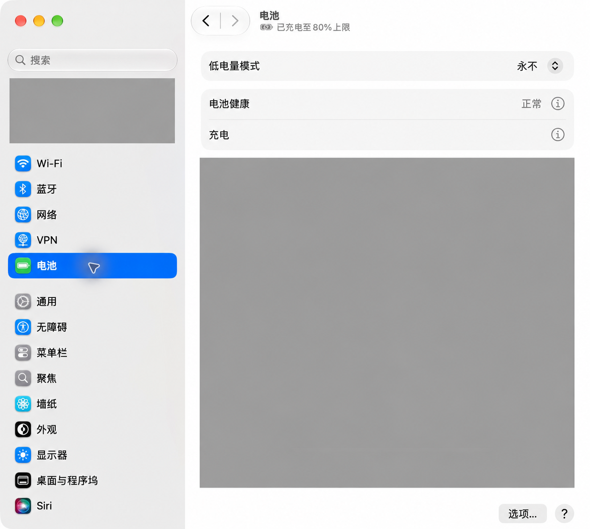
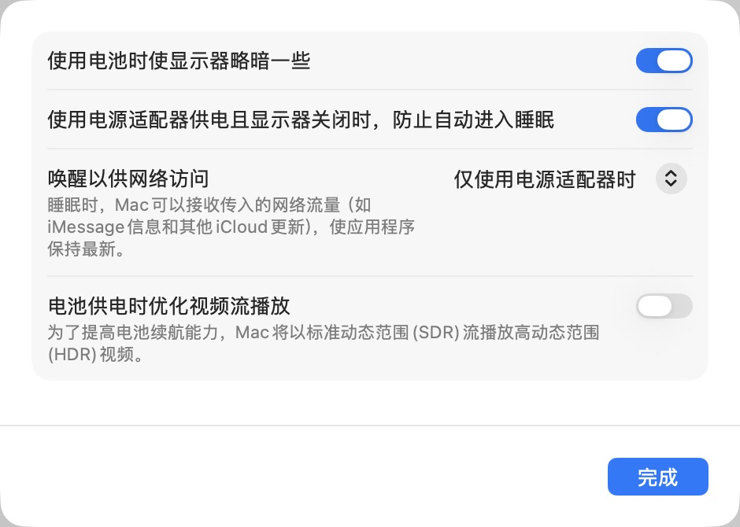
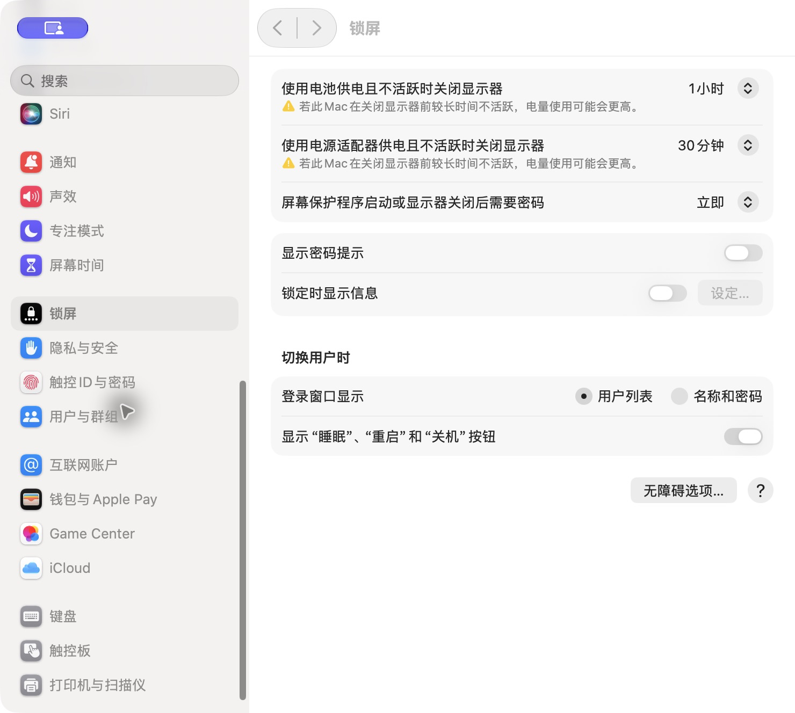

# 将 MacBook 配置为远程开发机

一台闲置的 Apple Silicon MacBook 可以承担代码构建、测试、命令行任务和容器开发。日常电脑负责输入和显示，MacBook 负责运行项目。先把电源与远程登录配置稳定，再按项目需要增加工具和容器。

本文以开盖接电的 MacBook 为目标，界面截图来自 macOS 27。不同版本的菜单名称可能略有变化。命令示例使用 macOS 默认的 zsh；示例中的 `<USER_ID>`、`<VERSION>` 必须替换后再执行。

**验证范围：电源、接电熄屏计时与密码要求已在实机保存并读取核对。手机 Codex 旧会话恢复未通过验收；最新复测与社区核查日期为 2026-10-10。SSH、开发工具、容器及重启恢复在本文作为配置步骤介绍，不据此宣称整条链路已完成实机验收。**

## 要解决的问题

远程开发需要同时满足三个条件：屏幕可以关闭、机器仍在运行、从其他设备能够重新连接。只延长屏幕亮着的时间，会浪费电量，也不能解决无人值守时的连接问题。

目标状态如下：

| 项目 | 目标 |
| --- | --- |
| 供电与摆放 | 接电、保持开盖，放在通风的桌面或支架上 |
| 闲置时的屏幕 | 接电时 30 分钟后关闭显示器 |
| 闲置时的锁屏 | 显示器关闭后立即要求密码，合计约闲置 30 分钟 |
| 闲置时的系统 | 接电时防止自动进入睡眠 |
| 远程网络 | 通过 Tailscale 私有网络连接 |
| 远程终端 | macOS 原生 SSH，仅允许指定用户 |
| 长任务 | 在 tmux 中运行，可在断线后重新接入 |
| Linux 容器 | 按需使用 Colima 提供运行环境 |
| 重启恢复 | 单独验证解锁、网络和服务恢复，不以熄屏测试代替 |

## 核心原理：熄屏、锁屏与睡眠分别处理

- **熄屏**关闭显示器。设置正确时，后台任务可以继续运行。
- **锁屏**要求认证后才能使用桌面，不等于系统睡眠。
- **睡眠**会影响计算和网络连接。远程开发机应在接电时防止因闲置自动睡眠。

“唤醒以供网络访问”可以作为辅助设置，但不能代替持续运行的配置。合盖、手动选择睡眠、耗尽电量和系统重启，也不能用“防止自动睡眠”这一选项保证在线。

## 第一步：开盖接电运行，屏幕自动熄灭

### 1. 开启接电时防止自动睡眠

打开 **系统设置 → 电池**，点右下角的 **选项**。



开启 **使用电源适配器供电且显示器关闭时，防止自动进入睡眠**，然后点 **完成**。如果有“唤醒以供网络访问”，可选择“仅使用电源适配器时”。这些设置对应 [Apple 的睡眠与唤醒说明](https://support.apple.com/zh-cn/guide/mac-help/mchle41a6ccd/27/mac/27)。



### 2. 设置闲置 30 分钟熄屏并锁屏

打开 **系统设置 → 锁屏**，将 **使用电源适配器供电且不活跃时关闭显示器**改为 **30 分钟**，将 **屏幕保护程序启动或显示器关闭后需要密码**设为 **立即**。如 macOS 要求验证，应由用户在本机认证弹窗完成。



这两个计时的起点不同：显示器计时从最后一次本机活动开始，密码延迟从熄屏或屏保启动开始。本例是“闲置约 30 分钟熄屏，并立即要求密码”，不是熄屏后再等 30 分钟。如果屏保更早启动或手动锁屏，认证状态可能更早出现。使用电池时的熄屏计时未在本轮修改，图中仍为 1 小时。

密码要求设为“永不”只改变熄屏或屏保后的认证条件，不能保证所有方式都不锁屏，也不是已经验证的 Codex 重连修复。本次取消密码要求后，旧会话在熄屏后仍无法恢复，详见后文。

### 3. 读取系统配置，确认保存结果

在这台 MacBook 的终端运行只读命令：

```sh
pmset -g custom
```

查看 `AC Power` 分组，关键值应为：

```text
sleep          0
displaysleep   30
```

其中 `sleep = 0` 表示禁用闲置系统睡眠计时，`displaysleep = 30` 表示显示器闲置 30 分钟后关闭。以上是两个字段的摘要，不是完整输出。可通过本机 `man pmset` 核对含义。

2026-10-10 本次实机读取确认接电分组为这两个值；锁屏界面显示接电 30 分钟熄屏、密码要求为立即。`pmset` 只核对电源字段，不能用它证明密码要求、手机会话恢复或整条远程链路正常。此前已开启的防止自动睡眠继续有效。

## 第二步：建立私有网络连接

在 MacBook 和日常使用的电脑上安装 Tailscale，登录同一私有网络中有访问权限的账户。按照 [Tailscale 的 macOS 安装文档](https://tailscale.com/docs/install/mac)，优先使用官方独立安装版本，完成网络扩展与 VPN 配置授权。

准备工作：

1. 在两端确认 Tailscale 显示已连接。
2. 在设备列表确认 MacBook 在线，记录它的设备名或 Tailscale 地址。
3. 若要使用设备名连接，确认私有网络已启用 MagicDNS。
4. 从外部网络测试连接，例如让客户端改用手机热点，避免只验证同一个 Wi-Fi 下的连接。

下文用 `dev-macbook` 作为通用设备名，不包含真实账户、地址或私有网络域名。没有启用 MagicDNS 时，将其替换为设备列表中的 Tailscale 地址。

这里使用 **Tailscale 提供网络、macOS 提供 SSH** 的组合。Tailscale GUI 版本与开源 CLI 版本的 SSH 服务能力不同；不要把安装 GUI 客户端理解为已经启用 SSH 服务。详见 [Tailscale SSH 的平台要求](https://tailscale.com/docs/features/tailscale-ssh)。

## 第三步：开启 macOS 原生 SSH

### 1. 只允许需要的用户远程登录

在 MacBook 上打开 **系统设置 → 通用 → 共享 → 远程登录**：

1. 开启“远程登录”。
2. 在“允许访问”中选择“仅这些用户”。
3. 添加实际用于开发的 macOS 用户。

“允许远程用户对磁盘进行完全访问”是另一项权限。先按项目实际需要配置，出现具体的受保护目录访问需求时再决定是否开启。[Apple 的远程登录说明](https://support.apple.com/zh-cn/guide/mac-help/mchlp1066/27/mac/27)介绍了这些选项。

在客户端测试连接：

```sh
ssh <USER_ID>@dev-macbook
```

`<USER_ID>` 是 MacBook 上允许远程登录的账户短名称，不是 Apple 账户邮箱。首次连接时核对主机指纹，确认连接的是预期设备，再接受记录。

### 2. 配置 SSH 密钥

以下命令在**客户端**执行。先检查目标文件是否已存在；存在时复用或换一个文件名，避免覆盖已有密钥：

```sh
ssh-keygen -t ed25519 -f ~/.ssh/id_ed25519_dev_macbook
```

为私钥设置口令。在能够通过密码登录 MacBook 后，将公钥追加到远端用户的授权文件：

```sh
cat ~/.ssh/id_ed25519_dev_macbook.pub | ssh <USER_ID>@dev-macbook 'umask 077; mkdir -p ~/.ssh; cat >> ~/.ssh/authorized_keys'
```

只传输 `.pub` 公钥。私钥保留在客户端。首次连接的身份确认和密钥操作可参考 [OpenSSH 的 ssh-keygen 手册](https://man.openbsd.org/ssh-keygen)。

在客户端的 `~/.ssh/config` 中添加：

```text
Host devmac
    HostName dev-macbook
    User <USER_ID>
    IdentityFile ~/.ssh/id_ed25519_dev_macbook
    IdentitiesOnly yes
    ServerAliveInterval 30
    ServerAliveCountMax 3
```

随后连接：

```sh
ssh devmac
```

连接保活用于发现连接中断，不会让休眠或断电的机器恢复运行。先保留一个已登录会话，用另一个终端验证密钥登录成功，再考虑调整其他认证策略。

## 第四步：安装开发工具，让长任务能在断线后继续

### 1. 建立基础工具环境

以下命令在 **MacBook** 上执行。先完成 Command Line Tools 安装界面：

```sh
xcode-select --install
```

若尚未安装 Homebrew，使用 [Homebrew 官网](https://brew.sh/)给出的安装命令，并按安装结束时的提示配置 Shell 路径：

```sh
/bin/bash -c "$(curl -fsSL https://raw.githubusercontent.com/Homebrew/install/HEAD/install.sh)"
```

安装基础工具：

```sh
brew install git tmux mise
```

用 mise 管理项目需要的运行时，按项目版本安装，而不是默认给所有项目使用同一版本。例如把 `<VERSION>` 替换为项目声明的版本：

```sh
mise use node@<VERSION>
```

按 [mise 的安装与激活说明](https://mise.jdx.dev/getting-started.html)接入所用 Shell，并提交项目的版本声明。SSH 新会话也要能找到相同工具；本机桌面终端能运行，不代表远程 Shell 路径已经正确。

### 2. 使用 tmux 保存终端会话

通过 SSH 登录 MacBook 后，建立一个会话：

```sh
tmux new -s dev
```

在会话内运行开发服务、构建或测试。按 **Ctrl+B，松开后按 D** 可离开会话；之后再次连接并接入：

```sh
tmux attach -t dev
```

tmux 可以让会话在 SSH 客户端断开后继续存在，但不能在 MacBook 重启后恢复已经退出的进程。更多操作见 [tmux 入门文档](https://github.com/tmux/tmux/wiki/Getting-Started)。

### 3. 按需接入远程 IDE

若习惯图形编辑器，可在日常电脑安装 VS Code 与 Remote - SSH 扩展，连接 SSH 配置中的 `devmac`，打开远端项目目录。构建、终端和工作区扩展在远端运行，代码不需要先同步到日常电脑。macOS 主机需要开启 Remote Login，见 [VS Code 的 Remote - SSH 文档](https://code.visualstudio.com/docs/remote/ssh)。

若远端开发服务只监听本机回环地址，例如端口 3000，可在客户端另开终端转发：

```sh
ssh -N -L 127.0.0.1:3000:127.0.0.1:3000 devmac
```

客户端随后访问 `http://127.0.0.1:3000`。该方式适合查看开发页面，不需要为临时服务配置公网访问。转发持续期间应保留该 SSH 会话；如果客户端端口已被占用，可换一个本地端口。

## 第五步：按需配置 Linux 容器

macOS 上的 Linux 容器需要 Linux 运行环境。本文使用 Colima，安装在 **MacBook** 上：

```sh
brew install colima docker
colima start --cpu 4 --memory 8 --disk 60
docker run --rm hello-world
docker ps
```

4 个 CPU、8 GiB 内存、60 GiB 虚拟磁盘是面向 32 GB 内存机器的起始配置建议，不是硬件要求或性能保证。按容器数量和实际内存压力调整。已有实例应先检查现有配置；不要为了修改资源直接删除包含开发数据的实例。参数与运行方式见 [Colima 官方说明](https://github.com/abiosoft/colima)。

需要登录后自动启动时，可以使用：

```sh
brew services start colima
```

这是 Colima [官方 FAQ](https://github.com/abiosoft/colima/blob/main/docs/FAQ.md)提供的方式。普通用户运行的 Homebrew 服务在用户登录时启动，不能据此认定它在 FileVault 解锁前已经就绪；见 [Homebrew 服务说明](https://docs.brew.sh/Manpage#services-subcommand)。

需要排查时，先读取状态：

```sh
colima status
docker context ls
docker info
```

Apple Silicon 环境优先选择支持 ARM64 的镜像。项目只提供 x86 镜像时，另行验证模拟运行的兼容性与性能，不能从“镜像能拉取”推导出应用已经可用。数据库数据使用持久化卷或明确的备份方案，测试镜像成功不等于数据库恢复能力已经验证。

## 适用边界：长期在线需要验证重启恢复

接电开盖、防止闲置睡眠，是持续运行的基础。日常维护还需要完成以下安排：

- 保留磁盘加密与系统更新，记录维护后的恢复步骤。
- 检查 Tailscale 设备密钥到期与访问策略，确保外出期间不会因凭据状态失去连接。
- 将代码和运行时版本纳入版本管理，数据库与其他持久化数据单独备份。
- 持续运行的服务使用合适的服务管理或容器重启策略；交互任务使用 tmux。
- 在有人能接触机器时，完成一次实际重启验收，并记录需要人工介入的步骤。

FileVault 的恢复能力取决于硬件、系统版本和网络条件。Apple 说明，Apple Silicon Mac 在 macOS 26 及以后可以在开启 Remote Login 且网络可用时，通过 SSH 在重启后解锁 FileVault。**这不证明安装的 Tailscale GUI 客户端在该阶段已经可达**，也不证明用户登录服务已经运行。参见 [Apple 的 FileVault 管理说明](https://support.apple.com/en-gb/guide/security/sec8447f5049/web)。未完成远程解锁验证时，应准备现场首次解锁的恢复方式。

## 验收：先验证熄屏，再验证网络与恢复

| 验收项 | 操作 | 通过标准 |
| --- | --- | --- |
| 配置保存 | 重新打开电池选项，并读取 `pmset -g custom` | 防止自动睡眠开启，接电分组为 `sleep=0`、`displaysleep=30`，锁屏界面密码要求为立即 |
| 熄屏后的连接 | 接电开盖，不操作 MacBook，等待超过 30 分钟；从客户端新建 SSH 连接 | 屏幕关闭后仍能登录并执行命令 |
| 手机新旧会话 | 熄屏后分别重试同一个旧任务与新测试任务；保持主机、网络和应用版本一致 | 分别记录是否加载历史、是否能发送指令、是否完成；新任务成功不能替代旧任务恢复验收 |
| 外部网络 | 客户端切换到另一网络，通过 Tailscale 登录 | 能重新连接，确认不是只在本地 Wi-Fi 可用 |
| 断线后的任务 | 在 tmux 中运行可观察任务，断开 SSH 后重新接入 | 会话和进程仍存在，输出继续变化 |
| 容器可用 | 检查 Colima 和 Docker 状态，运行项目的健康检查 | 容器运行且应用响应符合预期 |
| 重启恢复 | 在可现场接触机器时重启，检查解锁、Tailscale、SSH 和服务 | 能恢复连接与项目服务，或已明确记录人工恢复步骤 |

熄屏验证期间持续碰键盘或触控板会重置闲置计时。只看到一个一直未断开的 SSH 窗口也不够，应该新建连接并执行命令。将“配置字段正确”和“完整远程开发链路可用”分别记录。

## 常见错误与排查顺序

| 现象 | 优先检查 |
| --- | --- |
| 屏幕关闭后无法连接 | 实际是否接电、是否合盖、接电分组的睡眠值、私有网络是否在线 |
| 手机能运行新任务，但旧任务重连失败 | 会话恢复和历史加载；单独核查相关客户端错误，不直接归因于锁屏或整个主机离线 |
| Tailscale 在线，但 SSH 被拒绝 | Remote Login 是否开启、账户是否在允许列表、私有网络访问策略 |
| SSH 可用，但开发命令找不到 | 远程 Shell 初始化、Homebrew 路径、运行时管理器的激活与项目版本 |
| SSH 断开后任务结束 | 任务是否运行在 tmux 或服务管理器内，而不是直接依附于登录会话 |
| Docker 客户端无法连接 | Colima 是否运行、当前 Docker context、服务是否需要用户登录后启动 |
| 重启后机器失联 | 当前解锁阶段、基础网络、Tailscale 启动方式和服务恢复流程 |

排查时先确认状态，再修改设置。保留可用连接或现场恢复能力后，再调整登录认证、网络权限和服务启动方式。

## 手机 Codex：熄屏后旧会话无法恢复的结论

### 已观察到什么，尚未证明什么

2026-10-10 的最新复测更新了先前判断：**即使把熄屏后需要密码设为“永不”，熄屏后的旧会话仍显示无法重新连接。取消密码要求不是有效修复，锁屏也不是已经确认的唯一根因。**

| 证据 | 能支持的判断 | 不能据此推断 |
| --- | --- | --- |
| 用户确认 Mac 始终锁着，旧任务失败而新测试任务收到回复 | 至少有一条远程任务路径仍能工作 | 所有旧会话都可恢复，或锁屏完全没有影响 |
| 新测试任务在宿主读取接口中已完成，未记录任务错误 | 新任务成功不只是手机显示了已有文字 | 原旧任务的手机历史加载也成功 |
| 对应复测时段的电源记录未发现系统睡眠事件 | 没有证据把那次选择性失败归因为系统睡眠 | 熄屏、锁屏及会话恢复不存在任何交互 |
| 密码要求为“永不”时，用户仍复现旧会话失败 | 关闭认证不能解决该故障 | 单凭这个复测就找到了具体软件根因 |

失败旧任务的本地会话记录包含较大的单条工具返回内容。这只提供历史加载方向的排查线索；本地 JSONL 记录大小不等于发送给手机的响应大小。尚未定位到与失败请求对应的明确宿主错误，也没有证实固定的 2 MB 限制。“大任务”还可能同时代表历史长、输出大或生命周期复杂，不能直接归结为计算量太大。

因此继续保持接电防休眠与密码锁屏，把手机旧会话恢复单独视为尚未解决的软件问题。后台程序是否继续运行、主机是否可达、任务消息能否在手机加载，应分别验证。[OpenAI 的远程连接文档](https://learn.chatgpt.com/docs/remote-connections)说明主机需在线、保持运行并开启连接；这些前提本身不保证每个旧任务都能正确恢复。

### 社区反馈：状态与适用范围

下表于 **2026-10-10** 核查。GitHub 用户报告可用于确定相似症状，不能代替维护者根因结论或本机验收。

| 公开记录 | 核查状态 | 与本问题的关系及边界 |
| --- | --- | --- |
| [#43488：完成的旧会话无法加载或重连，新会话可用](https://github.com/openai/codex/issues/43488) | Open；页面未显示修复 PR | 症状最接近；未报告锁屏条件，不能称为“锁屏触发旧会话故障”的证明 |
| [#42129：较小总历史失败，更大总历史成功](https://github.com/openai/codex/issues/42129) | Open；页面未显示修复 PR | 更接近单条大记录处理，但使用 Mac 中转远程 Linux；不是已证实的通用尺寸阈值 |
| [#44110：手机历史落后并重连失败](https://github.com/openai/codex/issues/44110) | Open；10 月 9 日仍有失败反馈 | 新评论涉及 Cloud 任务；重登有效也是 Cloud 场景，尚未验证本地 Mac 会话 |
| [#38653：分页初始化只限制条数，不限制字节](https://github.com/openai/codex/issues/38653) | Open | 补充历史加载方向；第三方会话诊断工具也不等于修复手机加载 |
| [#38889：iOS 无法加载分页会话消息](https://github.com/openai/codex/issues/38889) | Open | 涉及 CLI 来源任务，与桌面任务并不完全相同 |
| [#22705：元数据出现，但消息加载失败](https://github.com/openai/codex/issues/22705) | Open | 相似的消息加载阶段故障，未证明本机同根因 |
| [#23948：锁屏后手机连接失败](https://github.com/openai/codex/issues/23948) | Closed；作者于 5 月 21 日关闭 | 页面没有明确修复版本或关联修复 PR；关闭状态不能用来证明本问题修复 |
| [#37231：熄屏/屏保后 Locked Computer Use 解锁失败](https://github.com/openai/codex/issues/37231) | Open；9 月 30 日仍有复现评论 | 针对原生 UI 操作的临时解锁；与整个手机旧会话无法打开需分别诊断 |
| [#24024：闲置后 409 Conflict，需要重新登记](https://github.com/openai/codex/issues/24024) | Closed；作者按重复问题关闭 | 本机未取得 409 证据，不应直接套用清理登记或数据库的方案 |

[官方更新记录](https://learn.chatgpt.com/docs/changelog)在 10 月 7 日 iOS 1.2026.272 中提到长线程流式性能、任务链接与列表等改进，10 月 2 日 1.2026.267 提到历史加载稳定性。但没有明确把上述旧会话重连报告标为已修复。核对两端版本后，可以重试同一个故障任务；只有实际恢复才能记为本机验证通过。

### 可用的绕行路径

1. **保留失败旧会话，从新任务接续有限工作。** 把当前目标、工作目录、已完成项和下一步整理为简短交接说明，不必复制整段工具输出。这是绕行，不是旧历史恢复；本次新测试曾成功，但不能保证新任务长期无故障。
2. **用 Tailscale + macOS SSH + tmux + Codex CLI 处理命令行开发。** 按前文建立 SSH 与 tmux，进入项目目录，在 tmux 内运行 `codex`。手机 SSH 客户端断开后，重新登录并执行 `tmux attach -t dev` 继续使用。这绕开手机 Remote 的旧消息界面，保留运行中的终端；不能完整替代桌面 GUI、Computer Use 或原桌面任务的审批界面。[Codex CLI 文档](https://learn.chatgpt.com/docs/cli)与 [tmux 入门](https://github.com/tmux/tmux/wiki/Getting-Started)分别说明运行入口和终端会话能力。
3. **把手机账户重新登录作为待验证选项。** [#44110 的 Cloud 评论](https://github.com/openai/codex/issues/44110)称明确退出再登录有效；评论场景不同，本机尚未测试。先确认登录凭据和恢复途径，再自行决定是否试，不应把重装、重配对或退出账号视为普遍修复。

优先保留原任务与可读取历史。暂不通过删除会话、修改原始记录、清理 SQLite 或安装第三方修复版来尝试恢复。若收集反馈，只提供经脱敏的错误文本、客户端版本、失败时间、旧/新会话对照及是否发生系统睡眠。

### 如何跟踪修复而不误报

持续跟踪时保存上述公开链接和首次核查状态，比较新评论、维护者答复、关联 PR 与发布说明。区分“有人报告有效”“代码已合入”“版本已发布”和“同一个故障旧会话在本机复测通过”。只看到 Closed、笼统的 reconnect 改进或新任务成功，不应宣布问题解决。

如交给 dot 跟踪，明确检查频率、时区、通知渠道与有价值的变化，并要求它确认实际保存的安排。[dot 的任务文档](https://learn.chatgpt.com/docs/dots/tasks-and-memory)说明固定周期工作需要已保存的日程；仅把来源连接给 dot 不会自动建立监控。本条是配置方法，不表示本文已经为读者创建跟踪任务。

## 截图与脱敏说明

本文三张图片用于说明电源、30 分钟熄屏与密码锁屏的界面路径。最新锁屏图替换原先 5 分钟计时图；认证弹窗及含设备名称的手机原图不发布。电池入口图片中的账户名、账户头像、家庭头像和个人使用记录已实色遮挡；另外两张图没有账户区域。发布用副本仅保留 PNG 渲染所需的数据块，已移除文本、EXIF 等附加元数据。原始截图与完整个人系统配置未纳入本文。

## 公开参考

- [Apple：设定 Mac 的睡眠和唤醒设置](https://support.apple.com/zh-cn/guide/mac-help/mchle41a6ccd/27/mac/27)
- [Apple：允许远程电脑访问你的 Mac](https://support.apple.com/zh-cn/guide/mac-help/mchlp1066/27/mac/27)
- [Apple：Managing FileVault in macOS](https://support.apple.com/en-gb/guide/security/sec8447f5049/web)
- [Tailscale：Install Tailscale on macOS](https://tailscale.com/docs/install/mac)
- [Tailscale：Tailscale SSH 平台要求](https://tailscale.com/docs/features/tailscale-ssh)
- [Homebrew：安装入口](https://brew.sh/)
- [Homebrew：服务管理](https://docs.brew.sh/Manpage#services-subcommand)
- [OpenSSH：ssh-keygen](https://man.openbsd.org/ssh-keygen)
- [mise：Getting started](https://mise.jdx.dev/getting-started.html)
- [tmux：Getting Started](https://github.com/tmux/tmux/wiki/Getting-Started)
- [VS Code：Remote Development using SSH](https://code.visualstudio.com/docs/remote/ssh)
- [Colima：官方说明](https://github.com/abiosoft/colima)
- [OpenAI：远程连接](https://learn.chatgpt.com/docs/remote-connections)
- [OpenAI：ChatGPT 与 Codex 更新记录](https://learn.chatgpt.com/docs/changelog)
- [OpenAI：Codex CLI](https://learn.chatgpt.com/docs/cli)
- [OpenAI：dot 的任务与记忆](https://learn.chatgpt.com/docs/dots/tasks-and-memory)
