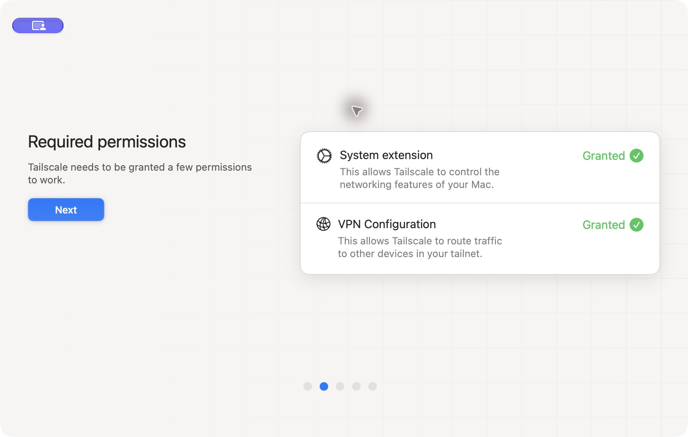
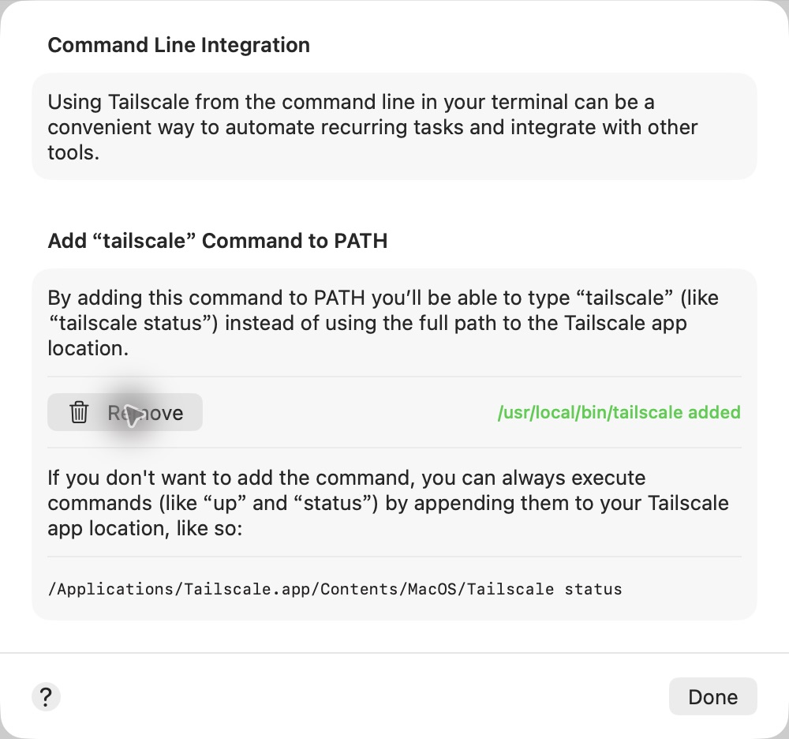
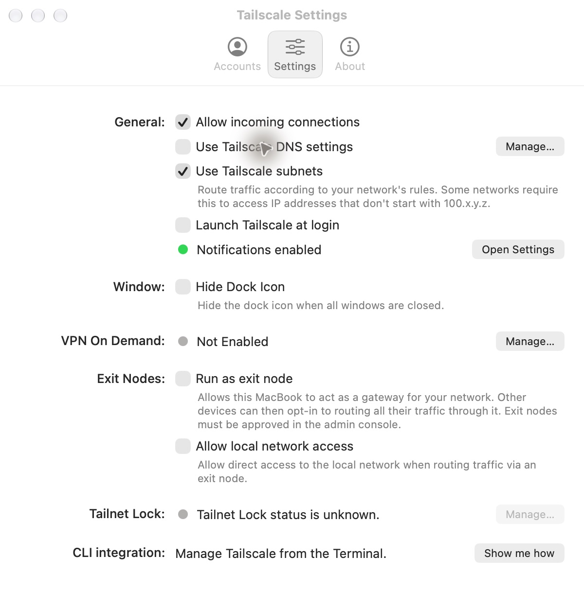
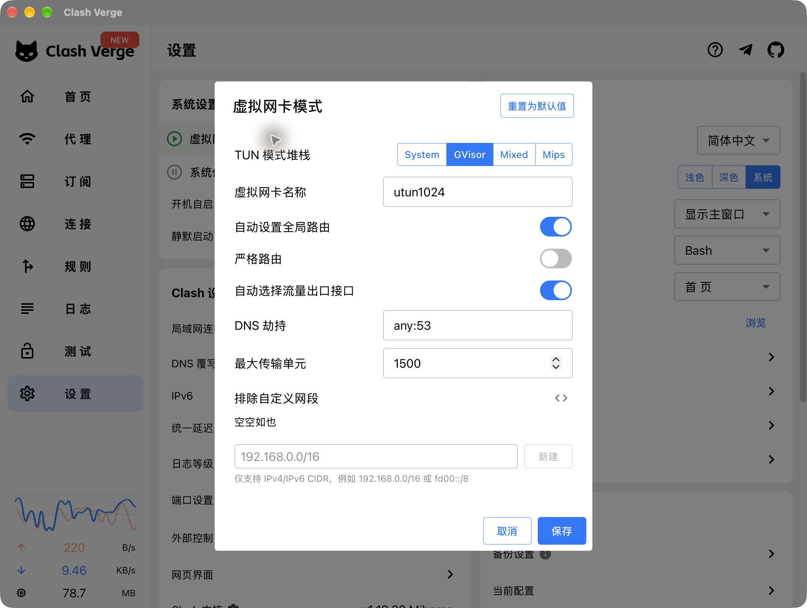
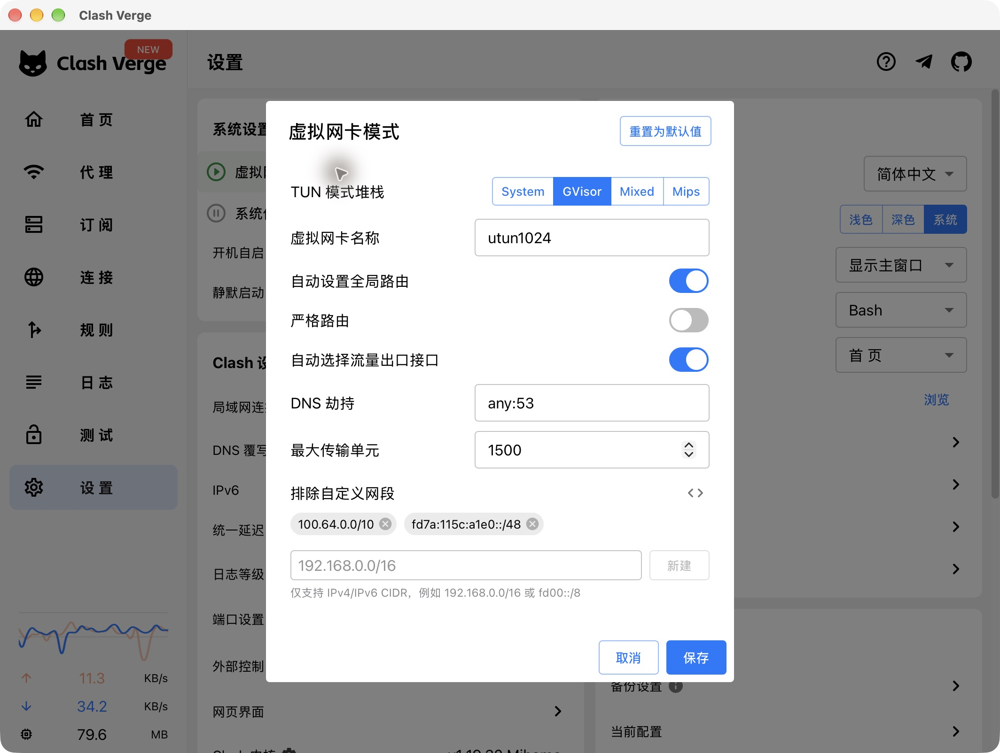
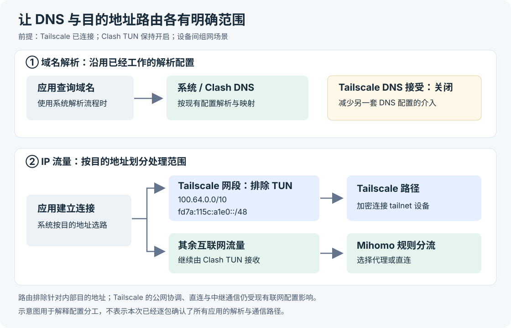

# macOS 上让 Tailscale 与 Clash TUN 共存：配置实践与原理

这次实践的目标是在同一台 MacBook 上同时使用两套网络工具：**Clash Verge Rev 保持 TUN 模式，处理日常联网与代理分流；Tailscale 提供设备间的私有网络连接。**

初始状态下，Clash 单独运行正常；一连接 Tailscale，需要代理的网站就打不开，断开 Tailscale 又恢复。最终关闭本机的 **Use Tailscale DNS settings**，并在 Clash TUN 中排除 `100.64.0.0/10` 与 `fd7a:115c:a1e0::/48`。2026 年 10 月 10 日，操作者手动测试后确认两者可以同时使用。

**修复组合已验证有效，唯一根因尚未被实验隔离。** 两项设置一起调整，故障期间没有取得完整的 DNS 与路由快照，也没有分别撤回其中一项做对照测试。因此，下面把实际记录与机制分析分开，不能把“修好后有效”写成“已经证明完全由 DNS 或某一条路由造成”。

## 环境与设置前后对照

| 项目 | 本次环境或状态 |
| --- | --- |
| 设备 | Apple Silicon MacBook Pro，M1 Pro |
| 系统 | macOS 27.0.1 |
| Tailscale | 官方 Standalone 桌面版 1.104.1 |
| Clash | Clash Verge Rev 2.5.7，Mihomo 1.19.32 |
| Clash 工作方式 | TUN 开启，规则模式，系统代理关闭 |
| Clash DNS | 内部 DNS 启用，使用 fake-ip 模式 |
| 场景 | 设备间私有组网，同时保留日常互联网代理 |

版本是本次实践的记录，不表示其他版本一定需要同样的调整。

| 设置 | 修改前 | 修改后 |
| --- | --- | --- |
| Tailscale：Use Tailscale DNS settings | 开启 | **关闭** |
| Clash：排除自定义网段 | 空 | **加入两个 Tailscale 网段** |
| Clash：TUN | 开启 | 保持开启 |
| Clash：自动设置全局路由 | 开启 | 保持开启 |
| Clash：严格路由 | 关闭 | 保持关闭 |
| Clash：自动选择流量出口接口 | 开启 | 保持开启 |
| Clash：协议栈 | GVisor | 保持 GVisor |
| Tailscale：Allow incoming connections | 开启 | 保持开启 |
| Tailscale：Use Tailscale subnets | 开启 | 保持开启；这只是接受子网路由的设置 |

本次没有通过关闭 Clash TUN 来解决，也没有更换 Tailscale 安装形态或把 Clash 出口强制绑定到某个物理网卡。

## 初始化：桌面版、权限与 CLI

### 1. 授权系统扩展和 VPN 配置

本机已经安装 Tailscale Standalone 桌面版。首次启动后，完成 **System extension** 与 **VPN Configuration** 授权，两个项目均显示 Granted。

在较新的 macOS 上，可从“系统设置 → 通用 → 登录项与扩展 → 网络扩展”管理 Tailscale 的扩展；系统要求验证身份时由操作者在本机完成。不同 macOS 版本入口可能不同，参见 [Tailscale 官方扩展授权说明](https://tailscale.com/docs/concepts/macos-sysext)。



*图 1 证明权限初始化完成，尚不能证明登录成功或两套网络工具兼容。*

### 2. 登录并加入私有网络

操作者在浏览器完成登录，Mac 加入目标 tailnet。文章不记录真实账户、设备地址或私有网络域名。登录与设备授权完成后，才进入共存排查。

### 3. 添加桌面应用自带的 CLI

在 Settings 的 **CLI integration → Show me how** 中添加命令入口，界面确认 `tailscale` 已加入 PATH。之后可在终端运行：

```sh
tailscale version
tailscale status
tailscale ip -4
```



**桌面版也有 CLI。** 这次添加的是桌面应用的命令入口，没有额外安装一套开源 `tailscaled` 后台服务；GUI 与 CLI 管理的是同一套客户端。官方区分 Standalone、App Store、开源 CLI-only 三种 macOS 发行形态，不能把“可以使用命令行”理解为“已经切换到 CLI-only”。[macOS 发行形态](https://tailscale.com/docs/concepts/macos-variants)与 [CLI 集成说明](https://tailscale.com/docs/reference/tailscale-cli?tab=macos)列出了相应区别。

### 4. 配置登录后自动启动

本次应用内 **Launch Tailscale at login** 设置报错，随后通过 macOS 的登录项添加 Tailscale，并确认系统列表中存在该项目。后面的设置截图仍显示应用内复选框未勾选，不能据此把它写成“应用内开关已经开启”。

系统登录项表示用户登录后启动应用；它不等同于开机尚未登录时就提供服务。远程开发机若需要重启后无人值守恢复，还要另行验证解锁、登录与网络恢复流程。

## 排障记录：能确认什么

| 阶段 | 记录或结果 | 证据性质 |
| --- | --- | --- |
| Tailscale 断开，Clash TUN 开启 | Google 的 `generate_204` 请求经显式 HTTP 代理与系统 TUN 路径均返回 HTTP 204 | 修改前的实际命令结果 |
| 连接 Tailscale | 需要代理的网站打不开 | 操作者复现 |
| 再断开 Tailscale | 网站恢复 | 操作者对照测试 |
| 故障期间 | 远程操作请求也出现超时，未获得完整的连接后诊断数据 | 排查限制，不能当作抓包证据 |
| 保存配置 | Clash 显示设置已应用，重新打开对话框仍有两个网段；生成配置也包含它们 | 界面与配置核对 |
| 配置语法 | 对含排除项的最小配置运行 Mihomo `-t`，校验通过 | 语法验证，不等于连通性验证 |
| 两项修改后 | 操作者手动开启 Tailscale，确认与 Clash 可以同时使用 | 修改后的人工验收 |

这组结果支持“冲突由 Tailscale 的连接状态触发，调整共存设置后恢复”。它没有证明先前所有网站、所有协议均失败，也没有证明手机访问 Mac、SSH、跨网连接或长期运行已经全部通过。

## 为什么之前可能不能一起用

### 1. DNS 决定地址，路由决定路径

访问网站通常先把域名解析成地址，再把连接交给操作系统选择路径。**解析成功和路径正确是两个条件。** 即使代理节点本身正常，DNS 解析超时、解析路径改变，或者流量进入了不合适的虚拟接口，都可能表现为网站打不开。

Clash TUN 会通过虚拟网卡接收被系统路由过来的 IP 流量，再由 Mihomo 规则选择代理或直连。Tailscale 则为私有网络目的地址提供自己的连接路径。两者都参与系统联网，兼容性取决于 DNS、路由、接口和访问策略的配合；不能仅凭桌面上有两个 VPN 图标就断言一定冲突。[Tailscale 与其他 VPN 共存说明](https://tailscale.com/docs/reference/faq/other-vpns)也列出了地址冲突、设备限制与网络策略等可能因素。

### 2. DNS 接管与 Clash 的 DNS 处理可能叠加

本次读取到 Clash 内部 DNS 使用 `fake-ip`，并配置了 `dns-hijack`。fake-ip 可以把域名映射到供代理内部识别的地址；基线请求的远端地址落在配置的 fake-ip 范围内，符合当时的工作方式。`dns-hijack` 会把匹配到的 DNS 连接送入 Mihomo 的 DNS 模块。[Mihomo DNS 配置](https://wiki.metacubex.one/config/dns/)与 [TUN 配置](https://wiki.metacubex.one/config/inbound/tun/)说明了这些选项。

Tailscale 的 **Use Tailscale DNS settings** 开启时，本机会接受 tailnet 下发的 DNS 配置；具体哪些查询被接管，取决于网络中的 MagicDNS、受限域名和全局 DNS 设置。它不意味着所有环境都会把全部 DNS 请求转给同一个地址。

如果连接 Tailscale 后，查询改走另一套解析器、DNS 请求受到 TUN 处理，或新的上游解析器在当前网络不可达，就可能出现查询失败或分流行为改变。绕过原来的 fake-ip 解析路径也可能改变域名与连接之间的关联，但**没有 fake-ip 并不必然导致代理失效**，域名规则还会受应用、嗅探和其他配置影响。

这些是符合现象的机制推断。本次没有捕获故障时的完整解析路径，不能断言“当时所有 DNS 都改到了某个服务器”或“已经证实存在 DNS 循环”。

### 3. Clash 的路由范围没有明确让出 Tailscale 地址

修改前 Clash 的“排除自定义网段”为空。Tailscale 使用的 IPv4 范围是 `100.64.0.0/10`，IPv6 范围是 `fd7a:115c:a1e0::/48`。普通互联网代理没有理由把这些私有组网目的地址转给代理节点。

若这些流量被 Clash 的 TUN 路由或规则接收，可能落到不合适的处理路径。**空排除列表只是一个潜在冲突点，并不是路由抢占已经发生的证据。** 系统会结合目的地址匹配、路由作用域和接口选择路径；Tailscale 的更具体路由也可能本来就能生效，不能简单理解成“最后启动的 VPN 抢走全部流量”。

显式排除的价值是减少两个工具对同一目的地址范围的处理重叠。它解决路由接管范围的问题；关闭 Tailscale DNS 接受设置则减少解析层的重叠。两项一起构成本次可用的配置组合。

## 实际修改步骤

### 1. 暂时断开 Tailscale，保留 Clash TUN

本次连接 Tailscale 会使远程操作链路也失效，因此先由操作者断开 Tailscale，在网络恢复后准备配置。最终连接测试仍由操作者手动完成，避免因排查工具失联而无法恢复现场。

### 2. 关闭本机接受 Tailscale DNS 设置

在 Tailscale Settings 中取消勾选 **Use Tailscale DNS settings**。本次这项变更得到操作者明确同意后才执行，并读取到复选框值为关闭。



这一操作关闭的是**这台 Mac 接受 tailnet DNS 配置的行为**，没有删除整个网络的 MagicDNS 配置，也没有停用 Tailscale 隧道或设备身份验证。官方将停止接受 DNS 设置列为单台设备关闭 MagicDNS 使用的方式。[MagicDNS 官方说明](https://tailscale.com/docs/features/magicdns#disabling-magicdns)

### 3. 在 Clash TUN 中添加两个排除网段

打开 Clash Verge Rev 的“设置 → 虚拟网卡模式”的配置入口，找到 **排除自定义网段**。



逐项加入以下内容，保存，然后重新打开对话框确认：

```text
100.64.0.0/10
fd7a:115c:a1e0::/48
```



| 网段 | 含义 |
| --- | --- |
| `100.64.0.0/10` | Tailscale 所使用的 IPv4 范围；不是全部 `100.*` 地址 |
| `fd7a:115c:a1e0::/48` | Tailscale 的 IPv6 范围 |

其对应的核心配置是：

```yaml
tun:
  auto-route: true
  route-exclude-address:
    - 100.64.0.0/10
    - fd7a:115c:a1e0::/48
```

这是便于理解的最小示例，不能替换整份订阅。若已有排除项，应保留并追加；也应先确认这些范围没有同时被运营商或其他 VPN 用于不同目的。Mihomo 的 `route-exclude-address` 用于在 `auto-route` 开启时排除指定网段。[选项定义](https://wiki.metacubex.one/config/inbound/tun/#route-exclude-address)

本次通过内置对话框保存，生成配置中也核对到了两个 CIDR。保存时，界面已有的虚拟网卡名 `utun1024` 与 MTU `1500` 一并成为显式配置；它们不是另外试验出来的共存参数，也不能据此认定它们是修复原因。

### 4. 在正确的配置层保存

不要只修改生成的“当前配置”文件：订阅刷新或配置重新生成后，手工变更可能消失。Clash Verge Rev 还会在扩展执行后，把应用接管的设置写回；TUN 对话框保存过的 `route-exclude-address` 等字段属于其中。因此，这次直接在 TUN 设置中持久化，并重新打开核对。[扩展配置与应用设置的优先级](https://www.clashverge.dev/guide/extend.html#与应用设置的优先级)

## 为什么这些设置之后可以共存



*图 6 是工作分工的示意，不是本次抓包结果。浏览器自带 DoH、显式代理和其他应用专用解析器可能采用不同路径。*

关闭接受 Tailscale DNS 设置后，Tailscale 连接不再通过该选项为这台 Mac 应用 tailnet 的 DNS 配置，减少了与原有系统、Clash 解析链路的重叠。日常网站仍可沿用已经工作的联网配置。

增加路由排除后，Clash 的自动 TUN 路由范围为 Tailscale 目的地址让出空间；这些地址交由系统中的 Tailscale 路径处理。其他互联网流量仍可进入 Clash，根据规则选择代理或直连。**两套工具能够共存，是因为解析和流量处理范围变得更明确。**

还要区分两层地址：访问 tailnet 设备的内部目的地址，与 Tailscale 建立加密通信时使用的公网端点不是同一层。排除两个私有组网范围，并不等于让 Tailscale 进程的一切联网行为都绕过 Clash。协调服务、直连端点或中继的公网通信，仍取决于现有网络和代理配置；本次没有单独修改它们。[Tailscale 的数据面与控制面原理](https://tailscale.com/blog/how-tailscale-works)

### TUN 排除、DIRECT 与系统代理绕过的区别

| 设置层 | 决定什么 | 本次用途 |
| --- | --- | --- |
| 系统代理绕过 | 遵守系统代理设置的应用是否使用 HTTP/SOCKS 代理 | 本机系统代理关闭，单改这里不能解决 TUN 接管范围 |
| Clash `DIRECT` 规则 | 流量已进入 Mihomo 后，选择直连出口 | 不等同于流量一开始就不经过 Clash TUN |
| TUN `route-exclude-address` | 自动路由时哪些目的网段不交给 Clash TUN | 本次用于让出 Tailscale 地址范围 |

这三层可以按需要组合，但不能互相当作同一个开关。[Clash Verge Rev 的 Bypass 说明](https://www.clashverge.dev/guide/bypass.html)分别介绍了这些设置。

## 验证与后续检查

本次保存后先核对界面、生成配置与语法，再交由操作者连接 Tailscale 做人工验收。操作者已确认可以同时使用；**没有保存修改后的网站测试截图、抓包或性能数据**，所以截图证明的是设置状态，成功结论来自人工反馈。

后续可分层检查，避免把“网站恢复”当作整个远程开发链路已经验收：

| 检查项目 | 操作 | 本次状态 |
| --- | --- | --- |
| 两套工具共存 | Clash TUN 开启时连接 Tailscale，复测原先失败的访问 | 操作者确认通过 |
| 对端可达 | 从另一设备访问 Mac 的 Tailscale 地址 | 未独立记录结果 |
| 应用服务 | 访问已配置的 SSH、远程桌面或开发服务 | 未在本次共存验收中逐项记录 |
| Mac 上的设备名解析 | 分别测试设备 IP 与 MagicDNS 名称 | 未独立验证 |
| 长期恢复 | 熄屏、网络切换、重启登录后复测 | 未在本次记录中验证 |

可供后续排查的只读命令：

```sh
tailscale status
tailscale ip -4
scutil --dns
```

需要检查路由时，将示例中的目标替换为实际对端地址：

```sh
route -n get <TAILSCALE_PEER_IP>
```

其中 `scutil --dns` 可能显示私有域名与解析配置，分享输出前应脱敏。对 macOS 的 MagicDNS 验证也不要只依赖 `host` 或 `nslookup`；官方说明这些工具可能绕过系统解析流程。[MagicDNS 访问说明](https://tailscale.com/docs/features/magicdns#accessing-devices-over-magicdns)

## 适用边界与常见误区

**关闭 DNS 接受设置会影响这台 Mac 使用 MagicDNS 或 tailnet 下发解析策略。** 直接访问设备的 Tailscale IP 不依赖设备名解析，但仍受隧道、访问策略和目标服务状态约束。手机若保持自己的 DNS 设置，Mac 上的这个开关不会同步关闭手机的 MagicDNS；能否用名称连接，仍应在手机端验证。

**子网路由需要另外考虑。** “Use Tailscale subnets” 开启只是接受相应路由，不代表当时已经存在某条子网路由。以后访问 Tailscale 子网路由器后面的局域网时，目标地址可能不在这两个范围内，应根据实际发布的 CIDR 补充排除，不能盲目排除所有私有地址。

**Exit node 会改变前提。** 本方案围绕设备间组网与独立的互联网代理建立。若让 Tailscale 接管全部互联网出口，需要重新分析默认路由和 DNS，不能直接沿用此次成功结论；“Run as exit node”与“使用另一台设备作为 exit node”也是不同功能。[其他 VPN 与 exit node 的边界](https://tailscale.com/docs/reference/faq/other-vpns#split-tunnels)

**手机的 VPN 限制与 macOS 不同。** Mac 上验证了 Tailscale 与 Clash TUN 共存，不代表 iOS 或 Android 上两个 VPN 客户端也能同时启用；这些平台通常只允许一个活动 VPN。需要在手机端单独选择联网方案。[Tailscale 官方兼容性说明](https://tailscale.com/docs/reference/faq/other-vpns)

**不要为证明原因而在无人值守时反复切换。** 本次已有可用组合。若确实需要进一步定位，可在能够现场恢复网络的条件下，每次只撤回一项，记录 DNS、路由和同一测试目标，再恢复已验证的设置。本次没有执行这种单变量实验。

## 截图与资料处理

文中选取五张设置截图，对应权限完成、CLI 入口、DNS 关闭、排除列表修改前与保存后。只使用应用窗口内不含账户、真实设备地址、订阅信息的视图，并清除图片附加元数据；未把原始订阅、配置备份或原始网络日志纳入文章。

图中的 `100.64.0.0/10`、`fd7a:115c:a1e0::/48` 是公开的技术网段，不是本机地址。图 5 是保存后重新打开的界面，与未保存草稿不同；没有把旧的未连接画面用作“共存成功”截图。

## 公开参考

- [Tailscale：与其他 VPN 共存的条件及边界](https://tailscale.com/docs/reference/faq/other-vpns)
- [Tailscale：MagicDNS 与单台设备关闭 DNS 接受设置](https://tailscale.com/docs/features/magicdns)
- [Tailscale：macOS 三种发行形态](https://tailscale.com/docs/concepts/macos-variants)
- [Tailscale：系统扩展授权](https://tailscale.com/docs/concepts/macos-sysext)
- [Tailscale：CLI 集成](https://tailscale.com/docs/reference/tailscale-cli?tab=macos)
- [Mihomo：TUN 路由排除与 DNS 劫持](https://wiki.metacubex.one/config/inbound/tun/)
- [Mihomo：DNS 配置](https://wiki.metacubex.one/config/dns/)
- [Clash Verge Rev：Bypass 的不同层次](https://www.clashverge.dev/guide/bypass.html)
- [Clash Verge Rev：扩展配置与应用设置优先级](https://www.clashverge.dev/guide/extend.html)
- [Tailscale：数据面、控制面与连接机制](https://tailscale.com/blog/how-tailscale-works)
